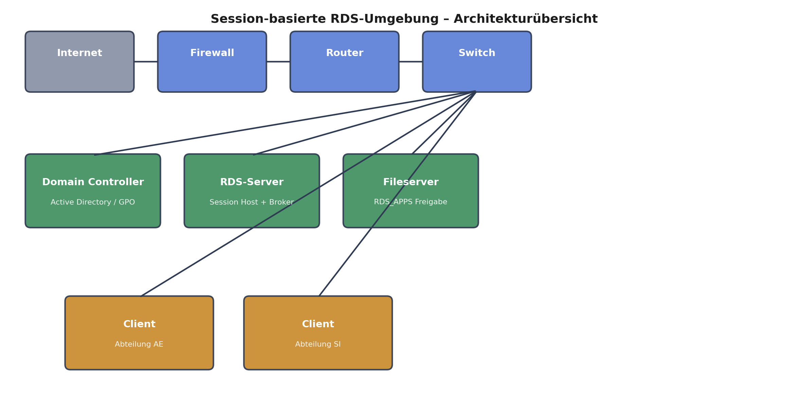

# Session-basierte RDS-Umgebung mit AD, Fileserver & GPO-gesteuerter App-Bereitstellung

Aufbau einer vollständigen Windows-Remote-Desktop-Services-Umgebung (Session-based
Deployment) inkl. Active Directory, zentralem Fileserver, GPO-gesteuerter
RemoteApp-Bereitstellung und rollenbasierter Zugriffssteuerung — realisiert in
einer virtuellen Testumgebung mit zwei fiktiven Fachabteilungen (Anwendungs-
entwicklung / Systemintegration) als Anwendungsfall.

## Warum dieses Projekt

Ziel war es, Endanwendern zentral gepflegte Software ortsunabhängig über einen
Session-Host bereitzustellen, statt jede Software lokal auf jedem Client zu
installieren und zu pflegen. Das reduziert Administrationsaufwand, vereinheitlicht
den Softwarestand und erlaubt granulare Zugriffssteuerung je nach Abteilung —
klassisches Terminalserver-/VDI-Szenario, wie es in vielen mittelständischen
Unternehmen und Bildungseinrichtungen mit heterogenen Client-Landschaften vorkommt.

## Architektur

#```mermaid
#flowchart LR
#    Internet((Internet)) --- FW[Firewall]
#    FW --- RT[Router]
#    RT --- SW[Switch]
#    SW --- DC[Domain Controller<br/>Active Directory / GPO]
#    SW --- RDS[RDS-Server<br/>Session Host + Connection Broker]
#    SW --- FS[Fileserver<br/>RDS_APPS Freigabe]
#    SW --- C1[Client – Abteilung AE]
#    SW --- C2[Client – Abteilung SI]
#```

#Statisches PNG (z. B. für LinkedIn oder Plattformen ohne Mermaid-Rendering):



| Komponente | Rolle |
|---|---|
| Domain Controller | Active Directory, OU-Struktur, Gruppenrichtlinien (GPO) |
| RDS-Server | Remote Desktop Session Host, Connection Broker, Web Access, RD-Gateway |
| Fileserver | Zentrale Freigabe `RDS_APPS`, Icon-Verteilung, AGDLP-Berechtigungen |
| Clients | Zwei Abteilungs-Clients mit je zwei Testnutzern |

Alle Komponenten sind Mitglied derselben Domäne. Der RDS-Server stellt Anwendungen
ausschließlich zentral bereit — die Clients führen keine lokale Installation der
Fachsoftware mehr aus.

## Umsetzung im Detail

### 1. RDS-Rollenbereitstellung
- Installationstyp **Remotedesktop**, Bereitstellungsszenario **sitzungsbasiert**
  (Standardbereitstellung, um jede Rolle individuell auf die passende Maschine
  zu legen statt Schnellstart-Alles-auf-einem-Server).
- Ein gemeinsames Zertifikat für Verbindungsbroker, Web Access und RD-Gateway,
  um eine durchgängig vertrauenswürdige TLS-Kette zwischen allen RDS-Rollen
  sicherzustellen.
- Authentifizierung über das RD-Gateway per Kennwort-Authentifizierung.

### 2. Active Directory / OU-Design
- Zwei-Ebenen-OU-Struktur: Firma → Abteilungs-OUs, darunter je Abteilung
  Benutzerkonten sowie die zugehörigen globalen und domänenlokalen
  Sicherheitsgruppen.
- Rechtevergabe nach **AGDLP**: Benutzer → globale Gruppe → domänenlokale
  Gruppe → NTFS-Berechtigung. Details siehe [`docs/berechtigungsmatrix.md`](docs/berechtigungsmatrix.md).

### 3. App-Bereitstellung & Zugriffssteuerung
- Software wird ausschließlich auf dem RDS-Server installiert und als
  RemoteApp veröffentlicht (Sitzungssammlung).
- Zugriff auf einzelne RemoteApps wird pro Abteilungsgruppe granular
  eingeschränkt — Abteilung "Anwendungsentwicklung" erhält z. B. Zugriff auf
  VS Code, Draw.io und Notepad++, Abteilung "Systemintegration" auf
  Wireshark, Nmap und Draw.io.
- Auf der Fileserver-Freigabe ist **Access-Based Enumeration** aktiv: Nutzer
  sehen nur die Ordner, für die sie tatsächlich berechtigt sind.

### 4. Automatisierte Verknüpfungs- und Icon-Verteilung per GPO + PowerShell
Damit Anwender bei jeder Sitzung automatisch die passenden, aktuellen
Desktop-Verknüpfungen samt Icons erhalten, ohne dass ein Admin manuell etwas
auf den Clients verteilen muss, greifen zwei GPO-gesteuerte Skripte ineinander:

- [`scripts/Anmeldeskript.ps1`](scripts/Anmeldeskript.ps1) — legt bei der
  Anmeldung einen versteckten Icon-Ordner im Benutzerprofil an und kopiert die
  abteilungsspezifischen `.ico`-Dateien aus der zentralen Freigabe dorthin.
- [`scripts/Abmeldeskript.ps1`](scripts/Abmeldeskript.ps1) — räumt bei der
  Abmeldung wieder auf, damit bei der nächsten Anmeldung garantiert der
  aktuelle Software-/Icon-Stand ausgerollt wird.

Ergänzend sorgen vier GPOs für die vollständige Automatisierung:

| GPO | Zweck |
|---|---|
| `erstellen_bei_Anmeldung` | bindet die An-/Abmeldeskripte in den Anmeldeprozess ein |
| `erstellen_der_Verknuepfungen` (AE) | erzeugt die RemoteApp-Verknüpfung auf dem Desktop, Zielpfad zeigt auf die AE-Freigabe |
| `erstellen_der_Verknuepfungen_Support` (SI) | dasselbe für die SI-Freigabe |
| `zuletzt_angemeldeten_Benutzer_nicht_anzeigen` | verhindert die Anzeige des zuletzt angemeldeten Nutzers am Login-Screen (Security Hardening) |

## Lizenzierung

Für Remotedesktop-Umgebungen gibt es zwei CAL-Modi mit unterschiedlicher
Kostenlogik — relevant für die Dimensionierung in der Praxis:

| | Pro Nutzer | Pro Gerät |
|---|---|---|
| Bindung | an den Benutzer | an das Gerät |
| Flexibilität | ein Nutzer kann von mehreren Geräten zugreifen | mehrere Nutzer teilen sich ein Gerät |
| Wirtschaftlich sinnvoll wenn | Nutzer von wechselnden Geräten zugreifen | wenige Geräte von vielen Nutzern geteilt werden (z. B. Schichtbetrieb) |

In diesem Setup wurde der **Pro-Nutzer**-Modus gewählt, da jeder Anwender von
unterschiedlichen Clients aus arbeiten können soll.

## Sicherheitsbetrachtung (Schutzbedarfsanalyse, Kurzfassung)

| Asset | Schutzbedarf | Begründung |
|---|---|---|
| RDS-Server | hoch | zentraler Angriffspunkt, hostet alle Anwendungen |
| Verfügbarkeit der Umgebung | mittel–hoch | Ausfall legt den Zugriff für alle Nutzer lahm |
| Clients / Netzwerk | mittel | begrenzte Angriffsfläche durch zentrale App-Ausführung |

Umgesetzte Maßnahmen im Projektumfang: rollenbasierte Zugriffskontrolle,
Access-Based Enumeration, AGDLP-Rechtevergabe, Verstecken des zuletzt
angemeldeten Nutzers. Bewusst **nicht** im Scope (da Teil der bestehenden
Firmeninfrastruktur): Firewall/IDS-IPS, Backup & Disaster Recovery,
zentrales Patch-Management, SIEM/Logging — diese Trennung wurde explizit
dokumentiert, um den Projektumfang von dauerhaften Betriebsaufgaben
abzugrenzen.

## Lessons Learned

- **Rechtevergabe ist fehleranfälliger als gedacht:** Beim ersten Testlauf
  griffen einzelne Berechtigungskombinationen nicht wie geplant — Ursache waren
  falsch verschachtelte Gruppenmitgliedschaften im AGDLP-Modell. Sauber
  behoben durch striktes Nachvollziehen der Gruppenkette
  Account → globale Gruppe → domänenlokale Gruppe statt direkter
  NTFS-Zuweisung an Benutzer.
- **Abmeldeskript-Design:** Aktuell braucht jede neue Anwendung eine eigene
  `Remove-Item`-Zeile im Abmeldeskript, da nur einzelne Verknüpfungen (nicht
  der gesamte Desktop) bereinigt werden sollen. Skalierbarer wäre, alle
  RDS-Verknüpfungen in einem dedizierten Unterordner zu bündeln und diesen
  Ordner bei Abmeldung komplett zu entfernen — das würde das Skript
  wartungsfrei gegenüber neuen Anwendungen machen.
- **Zweiter Domain Controller** für Ausfallsicherheit wurde bewusst aus dem
  Scope genommen, ist aber die logische nächste Ausbaustufe für einen
  produktiven Einsatz.

## Tech Stack

`Windows Server` · `Active Directory` · `Group Policy (GPO)` · `Remote Desktop Services` ·
`PowerShell` · `NTFS/AGDLP` · `RD Gateway / TLS`

## Repo-Struktur

```
.
├── README.md
├── scripts/
│   ├── Anmeldeskript.ps1
│   └── Abmeldeskript.ps1
├── docs/
│   └── berechtigungsmatrix.md
└── assets/
```
# rds-session-lab-
